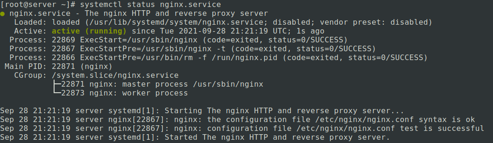
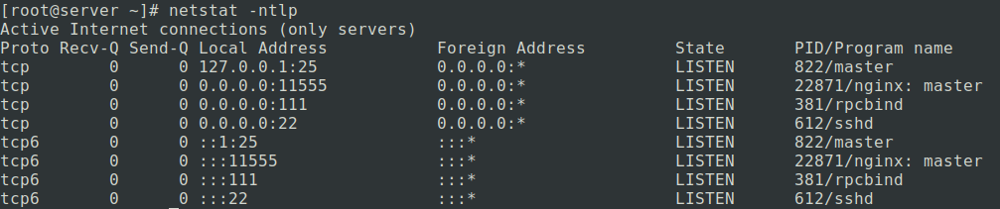
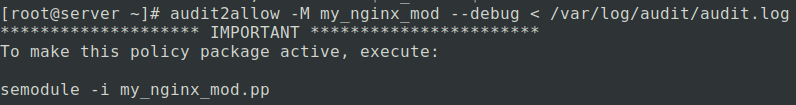
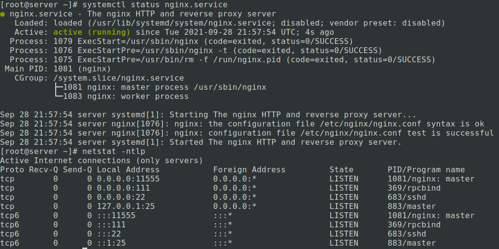

    Домашнее задание

Практика с SELinux
Цель:

Тренируем умение работать с SELinux: диагностировать проблемы и модифицировать политики SELinux для корректной работы приложений, если это требуется.

    
1. Запустить nginx на нестандартном порту 3-мя разными способами:  
1.1 переключатели setsebool;  
1.2 добавление нестандартного порта в имеющийся тип;  
1.3 формирование и установка модуля SELinux.  
---
2. Обеспечить работоспособность приложения при включенном selinux:

* [развернуть приложенный стенд (ссылка)](https://github.com/mbfx/otus-linux-adm/tree/master/selinux_dns_problems);
*    выяснить причину неработоспособности механизма обновления зоны (см. README);
*    предложить решение (или решения) для данной проблемы;
*    выбрать одно из решений для реализации, предварительно обосновав выбор;
*    реализовать выбранное решение и продемонстрировать его работоспособность. К сдаче:
*    README с анализом причины неработоспособности, возможными способами решения и обоснованием выбора одного из них;
*    исправленный стенд или демонстрация работоспособной системы скриншотами и описанием.

Критерии оценки:

Статус "Принято" ставится при выполнении следующих условий: 

   * для задания 1 описаны, реализованы и продемонстрированы все 3 способа решения;
   * для задания 2 описана причина неработоспособности механизма обновления зоны;
   * для задания 2 реализован и продемонстрирован один из способов решения.

Опционально для выполнения:

   * для задания 2 предложено более одного способа решения;
   * для задания 2 обоснованно(!) выбран один из способов решения.

---

Задание 1

Изменим порт в конфигурации nginx c 80 на 11555
При попытке запустить службу на новом хосте мы получим ошибку:
```
[root@server ~]# systemctl start nginx.service 
Job for nginx.service failed because the control process exited with error code. See "systemctl status nginx.service" and "journalctl -xe" for details.
```
Есть несколько варантов поиска возможных проблемм:
1. journalctl -xe
2. лог ```/var/log/audit/audit.log```(самый неудобный)
3. перенаправить лог(2) в утилиту ```audit2why <==> audit2allow -w``` *

```
[root@server ~]# audit2why --input /var/log/audit/audit.log
type=AVC msg=audit(1632861768.838:952): avc:  denied  { name_bind } for  pid=3456 comm="nginx" src=11555 scontext=system_u:system_r:httpd_t:s0 tcontext=system_u:object_r:unreserved_port_t:s0 tclass=tcp_socket permissive=0

	Was caused by:
	The boolean nis_enabled was set incorrectly. 
	Description:
	Allow nis to enabled

	Allow access by executing:
	# setsebool -P nis_enabled 1
```

как видим тут нам говорят что значение ```nis_enabled``` установленно некоректно и тут же предлагают решение - использовать команду: 
```
setsebool -P nis_enabled 1
```
> -P - Записать изменение политики в ядро
> [0|1, on|off] - значение политики
(применение см. ниже п1.1)
##### *устанавливается ```yum install policycoreutils-python```
---
1.1 переключатели setsebool:
-это самый "топорный" метод объявления политик - булевый тип переменных (on/off).
Что бы увидеть все политики доступные для изменения воспользуемся командой ```getsebool -a``` **
##### ** из пакета __setools-console__  

Изменим политику ```nis_enabled``` :
```
setsebool -P nis_enabled 1
```

запустим | перезапустим - nginx:
```
systemctl start nginx.service
```


```netstat -ntlp```


Как видим наша служба успешно запущена

---

1.2 добавление нестандартного порта в имеющийся тип;  
Добавим свой порт в контекст nginx
```
semanage port -a -t nginx_port_t -p tcp 11555
```
---

1.3 формирование и установка модуля SELinux:  
создадим модуль на основе дебага лога:
```
audit2allow -M my_nginx_mod --debug < /var/log/audit/audit.log
```
получим следующий вывод:

установим новый модуль в систему:
```
semodule -i my_nginx_mod.pp
```
это займет немного времени...  
Перезапустим nginx
```
systemctl status nginx.service
```


---

Задание 2

* [развернуть приложенный стенд (ссылка)](https://github.com/mbfx/otus-linux-adm/tree/master/selinux_dns_problems);

- Скачиваем себе файлы (```git clone```)
- ```vagrant up``` - разворачиваем стенд
- ```vagrant status``` - смотрим какие ВМ создались
```
Current machine states:

ns01                      running (virtualbox)
client                    running (virtualbox)

This environment represents multiple VMs. The VMs are all listed
above with their current state. For more information about a specific
VM, run `vagrant status NAME`.
```  

*    выяснить причину неработоспособности механизма обновления зоны (см. README);

Для выяснения причины попробуем временно перевести режим работы SELinux в статус permissive и попробуем еще раз обновить доменную зону.
```
[root@client ~]# nsupdate -k /etc/named.zonetransfer.key
> server 192.168.50.10
> zone ddns.lab
> update add www.ddns.lab. 60 A 192.168.50.15
> send
update failed: SERVFAIL
```
не получилось, давайте взглянем на логи
На client - ничего, а вот на ns01 мы видим кое что интересное...

```
[root@ns01 ~]# audit2why -i /var/log/audit/audit.log
type=AVC msg=audit(1633096134.359:2265): avc:  denied  { create } for  pid=4986 comm="isc-worker0000" name="named.ddns.lab.view1.jnl" scontext=system_u:system_r:named_t:s0 tcontext=system_u:object_r:etc_t:s0 tclass=file permissive=0

	Was caused by:
		Missing type enforcement (TE) allow rule.

		You can use audit2allow to generate a loadable module to allow this access.

[root@ns01 ~]# audit2allow -i /var/log/audit/audit.log

#============= named_t ==============

#!!!! WARNING: 'etc_t' is a base type.
allow named_t etc_t:file create;
```
"Отсутствует правило разрешения принудительного исполнения типа" и нам предлагают создать загружаемый модуль, с помощью ```audit2allow```, что бы разрешить добавлять файлы и изменять их.

chcon -R -t named_t etc_t test1
Из этого делаем вывод: 
что у нас есть 2 варианта решения данной проблеммы:  
1 - создать предлогаемый модуль
```
[root@ns01 ~]# audit2allow -M load_module --debug < /var/log/audit/audit.log
******************** IMPORTANT ***********************
To make this policy package active, execute:
semodule -i load_module.pp
```
Создаются 2 файла:
```
- load_module.pp - (бинарник) - сам модуль для устоновки.
- load_module.te - (текстовый) - информация о модуле.
```
Посмотрим описание модуля:
```
[root@ns01 ~]# cat load_module.te
module load_module 1.0;
require {
	type etc_t;
	type named_t;
	class file create;
}
#============= named_t ==============
#!!!! WARNING: 'etc_t' is a base type.
allow named_t etc_t:file create;
```

Для установки созданного модуля:
```
[root@ns01 ~]# semodule -i load_module.pp
```

2 - или изменить базовый тип (etc_t) на (named_t) что бы дать всем доступ на редактирование

попробуем реализовать оба варианта
Сейчас мы имеем контекст:  
```
[root@ns01 ~]# ls -Z /etc/named/       
drw-rwx---. root named unconfined_u:object_r:etc_t:s0   dynamic
-rw-rw----. root named system_u:object_r:etc_t:s0       named.50.168.192.rev
-rw-rw----. root named system_u:object_r:etc_t:s0       named.dns.lab
-rw-rw----. root named system_u:object_r:etc_t:s0       named.dns.lab.view1
-rw-rw----. root named system_u:object_r:etc_t:s0       named.newdns.lab

```
Для изменения контекста в директории ```/etc/named/```:
```
[root@ns01 ~]# semanage fcontext -a -t named_zone_t "/etc/named(/.*)?"
[root@ns01 ~]# restorecon -R /etc/named
```
получили:
```
[root@ns01 ~]# ls -Z /etc/named/
drw-rwx---. root named unconfined_u:object_r:named_zone_t:s0 dynamic
-rw-rw----. root named system_u:object_r:named_zone_t:s0 named.50.168.192.rev
-rw-rw----. root named system_u:object_r:named_zone_t:s0 named.dns.lab
-rw-rw----. root named system_u:object_r:named_zone_t:s0 named.dns.lab.view1
-rw-rw----. root named system_u:object_r:named_zone_t:s0 named.newdns.lab
[root@ns01 ~]# 
```
