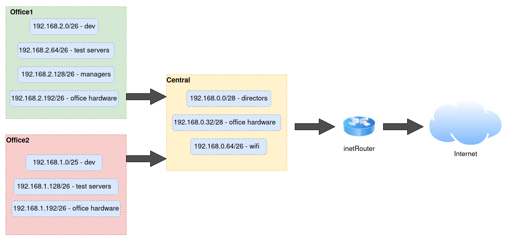

# Архитектура сетей:

Домашнее задание:

Дано (https://github.com/erlong15/otus-linux/tree/network) 



Итого должны получится следующие сервера:

*    inetRouter
*    centralRouter
*    office1Router
*    office2Router
*    centralServer
*    office1Server
*    office2Server


### Теоретическая часть

*    Найти свободные подсети
*    Посчитать сколько узлов в каждой подсети, включая свободные
*    Указать broadcast адрес для каждой подсети
*    проверить нет ли ошибок при разбиении

### Практическая часть

*    Соединить офисы в сеть согласно схеме и настроить роутинг
*    Все сервера и роутеры должны ходить в инет черз inetRouter
*    Все сервера должны видеть друг друга
*    у всех новых серверов отключить дефолт на нат (eth0), который вагрант поднимает для связи
*    при нехватке сетевых интервейсов добавить по несколько адресов на интерфейс
---

*    Найти свободные подсети

Для этого воспользуемся ip калькулятором  

office1-network
```
192.168.2.0/26 - dev
HostMin:	192.168.2.1
HostMax:	192.168.2.62
Broadcast:	192.168.2.63

192.168.2.64/26 - test servers
HostMin:	192.168.2.65
HostMax:	192.168.2.126
Broadcast:	192.168.2.127

192.168.2.128/26 - managers
HostMin:	192.168.2.129
HostMax:	192.168.2.190
Broadcast:	192.168.2.191

192.168.2.192/26 - office hardware
HostMin:	192.168.2.193
HostMax:	192.168.2.254
Broadcast:	192.168.2.255

Доступно: 62+62+62+62= 248 шт.
```

office2-network
```
192.168.1.0/25 - dev
HostMin:	192.168.1.1
HostMax:	192.168.1.126
Broadcast:	192.168.1.127

192.168.1.128/26 - test servers
HostMin:	192.168.1.129
HostMax:	192.168.1.190
Broadcast:	192.168.1.191

192.168.1.192/26 - office hardware
HostMin:	192.168.1.193
HostMax:	192.168.1.254
Broadcast:	192.168.1.255

Доступно: 126+62+62= 250 шт.
```

Central-network
```
192.168.0.0/28 - directors
HostMin:	192.168.0.1
HostMax:	192.168.0.14
Broadcast:	192.168.0.15

192.168.0.32/28 - office hardware
HostMin:	192.168.0.33
HostMax:	192.168.0.46
Broadcast:	192.168.0.47

192.168.0.64/26 - wifi
HostMin:	192.168.0.65
HostMax:	192.168.0.126
Broadcast:	192.168.0.127

Доступно: 14+14+62= 90 шт.
Не задействованно - 160 шт.
```
---

## Практическая часть