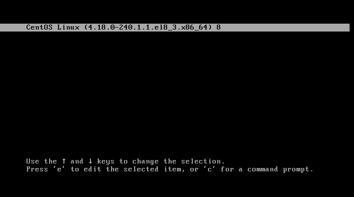
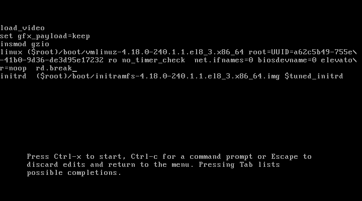
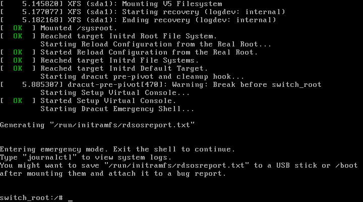
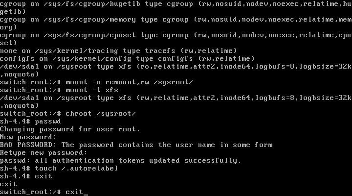
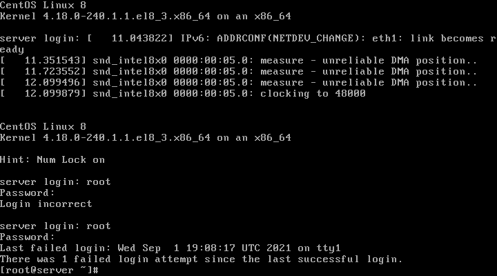
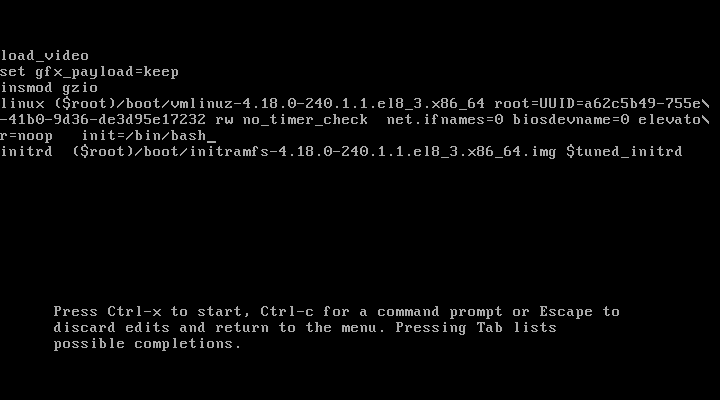

# Загрузка системы
## Домашнее задание
1. Попасть в систему без пароля несколькими способами.
2. Установить систему с LVM, после чего переименовать VG.
3. Добавить модуль в initrd.
4. *Сконфигурировать систему без отдельного раздела с /boot, а только с LVM Репозиторий с пропатченым grub: https://yum.rumyantsev.com/centos/7/x86_64/ PV необходимо инициализировать с параметром --bootloaderareasize 1m

---
### 1. Попасть в систему без пароля несколькими способами.
---
1. способ:  

Перезапускаешь машину, уходишь в grub, в меню выбора ядра для загрузки, на первом пункте нажимаем -e- (edit).
 
Ищем строку с параметрами ядра linux, в конце этой строки пишем ```rd.break``` (опционально убираем quiet):
 

потом  ctrl+x - идет перезагрузка...  
Пропадаем в shell:  

Смотрим список примонтированных ФС командой ```mount```,  ищем .```/sysroot```, видим что он _ro_ (read only), перемонтируем его и делаем доступным на запись _rw_ (read write): *(см.скрин. ниже)*
```
mount -o remount,rw /sysroot/
``` 
\*проверим как примонтировалось ```mount -t```(ro-ReadOnly сменилось на rw-ReadWrite) .  

Заходим в образ системы ```/sysroot/```:
```
chroot /sysroot/ 
```

Меняем пароль пользователю ```root```:
```
passwd 
```

*Если selinux включён, нужно создать файл ```.autorelabel``` в корне ```/```:
```
touch /.autorelabel
```
если не включён, можно сразу делать exit, exit.
selinux востановит контекст и перезагрузит систему



>*если после перезагрузки контекст не востановился то перезагружаемся и идем опять править строку с параметрами запуска - в конце строки с параметрами ядра добавляем autorelabel=1
и перезагружаемся - контекст должен переустановиться
после еще раз перезагрузится и загрузит систему

Ура!


---
* 2 способ  

В строке с параметрами ядра заменяем __ro__ (ReadOnly) на __rw__ (ReadWrite) так же после дописываем 
```
init=/bin/bash 
```
так вместо системы инициализации запуститься оболочка bash.   

После нажимаем -ctrl+x-


Прогрузим окружени пользователя ($PATH):
```
su - 
```
на системах где включен selinux:
```
load_policy -i /etc/selinux/targeted/policy/policy...<tab>
``` 
Меняем пароль root пользователю:
```
passwd 
```

После перезагружаемся через меню VirtualBox (Машина > перезапустить).

---

### 2. Установить систему с LVM, после чего переименовать VG.

В качестве стенда возьмем Vagrant-файл из 3 домашнего задания, на котором уже имееются раделы на LVM.
```
[root@lvm ~]# lsblk
NAME                    MAJ:MIN RM  SIZE RO TYPE MOUNTPOINT
sda                       8:0    0   40G  0 disk 
├─sda1                    8:1    0    1M  0 part 
├─sda2                    8:2    0    1G  0 part /boot
└─sda3                    8:3    0   39G  0 part 
  ├─VolGroup00-LogVol00 253:0    0 37.5G  0 lvm  /
  └─VolGroup00-LogVol01 253:1    0  1.5G  0 lvm  [SWAP]
```
 Переименуем VG:
```
vgrename VolGroup00 vg_root
```
```
[root@lvm ~]# lsblk
NAME                 MAJ:MIN RM  SIZE RO TYPE MOUNTPOINT
sda                    8:0    0   40G  0 disk 
├─sda1                 8:1    0    1M  0 part 
├─sda2                 8:2    0    1G  0 part /boot
└─sda3                 8:3    0   39G  0 part 
  ├─vg_root-LogVol00 253:0    0 37.5G  0 lvm  /
  └─vg_root-LogVol01 253:1    0  1.5G  0 lvm  [SWAP]
```
Переименуем VG в конфигах, что бы мы могли загрузиться:

```
sed -i 's/VolGroup00/vg_root/g' /boot/grub2/grub.cfg 
sed -i 's/VolGroup00/vg_root/g' /etc/fstab 
sed -i 's/VolGroup00/vg_root/g' /etc/default/grub
```

Теперь пересоздадим образ начальной системы инициализации - initramfs
```
mkinitrd -f -v /boot/initramfs-$(uname -r).img $(uname -r)
```

Перезагружаемся
```
reboot
```
*!!! После необходимо еще раз перезагрузить ВМ (с 1 раза VM не поднялась) !!!

### 3. Добавить модуль в initrd.
``` 
yum install plymouth\* 
```
```
cd /usr/lib/dracut/modules.d/
```
```
cat >module-setup.sh<<EOF
#------------------------------------------------
#!/bin/bash

check() {
     return 0 
} 
depends() {
     return 0 
} 
install() {
     inst_hook cleanup 00 "/usr/lib/dracut/modules.d/01test/test.sh" 
} 
EOF
```
```
vi test.sh
```
Вставяем нашего пингвина:
```
#------------------------------------------------
#!/bin/bash 
exec 0<>/dev/console 1<>/dev/console 2<>/dev/console 
cat <<'msgend' 
 ___________________ 
< I'm dracut module > 
 ------------------- 
    \
     \ 
        .--. 
       |o_o | 
       |:_/ | 
      //   \ \ 
     (|     | ) 
    /'\_   _/`\ 
    \___)=(___/ 
msgend 
sleep 10 
echo " continuing...."
#------------------------------------------------
```
Выдаем этим 2-м файлам права на исполнение:
```
chmod +x ./*
```
Переделываем наш конфиг файл:
```
mkinitrd -f -v /boot/initramfs-$(uname -r).img $(uname -r)
```

>...  
*** Creating image file ***  
*** Creating image file done ***  
*** Creating initramfs image file '/boot/initramfs-3.10.0-862.2.3.el7.x86_64.img' done ***

Проверим что наш модуль включен:
```
lsinitrd -m /boot/initramfs-$(uname -r).img | grep test
```
>test